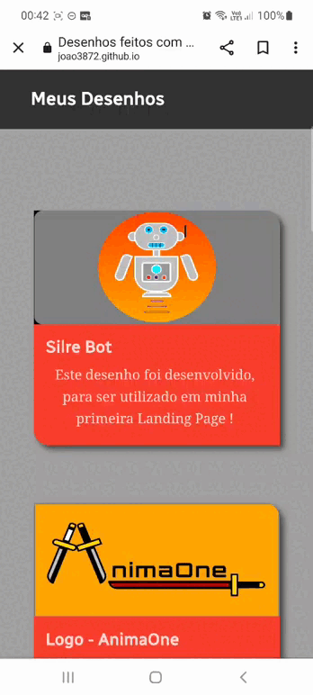
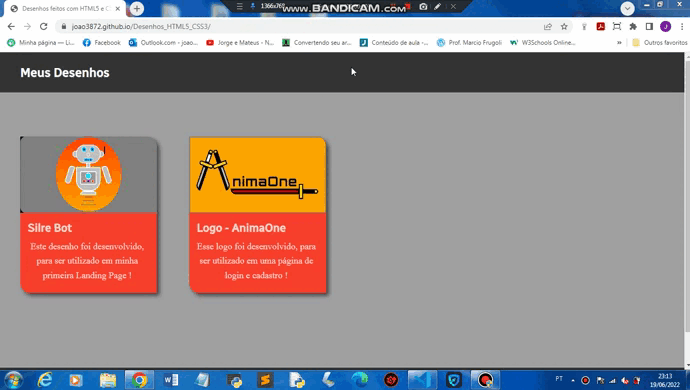

## Desenhos com HTML5 e CSS3

### Observações:

* Silre Bot, é o meu primeiro Desenho / Ilustração, com HTML5 e CSS3 !

* AnimaOne, é o meu segundo Desenho / Ilustração, trata-se de uma Logo !

### Versão Mobile 📱:

### Versão Desktop 💻:

### Veja você mesmo:

* #### <a href="https://joao3872.github.io/Desenhos_HTML5_CSS3/">Acessar</a>
